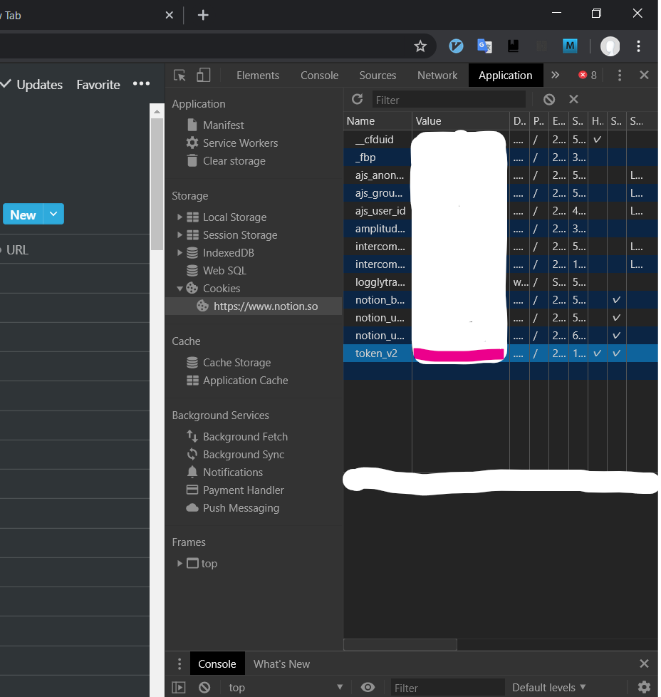
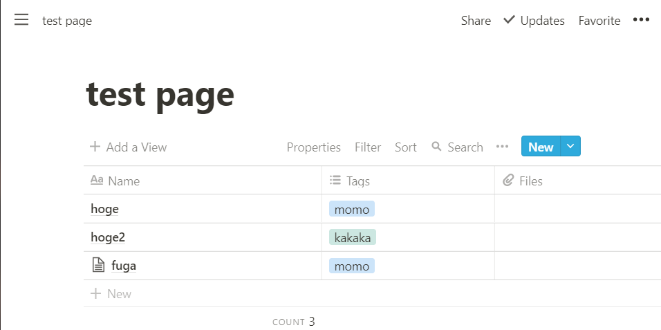

# pdf2notion
This is a tool for Notion to upload images by converting PDF.  
PDFを画像に変換して、Notionへ保存します。  

I use this program to save PDF as images.  
授業で配布されたPDFを画像として保存しておきたいから。  


# installation
```sh
git clone https://github.com/eetann/pdf2notion
cd pdf2notion
make init
cp ./pdf2notion/pdf2notion.json ~/pdf2notion.json
```

Then, you need to edit pdf2notion.json that is located at home directory.  
```json
{
    "pdf_dir" : [
        {"dir": "/mnt/d/lessons/2020/security2", "tags" : ["2020", "security2"]},
        {"dir": "/mnt/d/lessons/2019/security1", "tags" : ["2020", "security1"]},
        {"dir": "/mnt/d/lessons/2019/info_theory", "tags" : ["2019", "info_theory"]}
    ],
    "token_v2" : "your token_v2",
    "url" : "your table url"
}
```
**pdf_dir** : array that element are dict.  
**dir** : directory where PDF files are located.  
**tags** : tags array. each tag needs to be exist in Notion page where you want to upload.  
**token_v2** is a value that you can get from Cookeis.  
  
**url** : URL that is database.  
  

# Run
`make run` or `python3 -m pdf2notion`  

# cation⚠
This program is for me.  
I just execute this on WSL only.  
